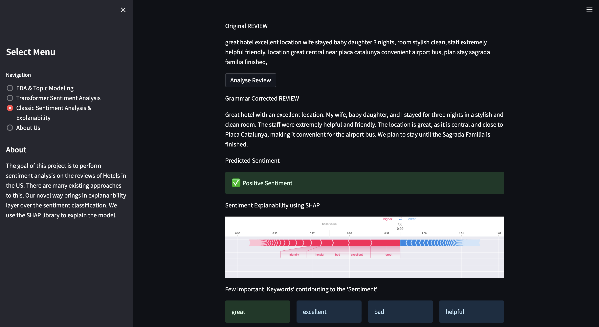

# Explainable Sentiment Analysis using Hotel Reviews
> #### _Archit, Neha, Zenan | Spring '23 | Duke AIPI 540 NLP Project_
&nbsp;

## Project Description
When travelling to a new place one of the most hectic tasks is to search for a good place to stay. On various travel websites, one finds multiple listings of hotels which can generally be filtered by the ratings. But even so, one would have to read through many reviews to make sure that the amenities that they are looking for are up to the mark for a given hotel. This is where our project comes in...

We train a model on a dataset that has user reviews for a hotel and the corresponding ratings. What is expected of the model is to understand what a positive review looks like and then predict the nature of the reviews that it has not seen before. Once we have found out the sentiment of the review, we employ techniques like dependency parsing and SHAP analysis to find the relevant attributes that make these sentiments positive. So basically we predict if the stay at the hotel will be great and if so, what is it that actually makes it great.


&nbsp;
&nbsp;
## Running the demo (StreamLit)

**1. Clone this repository and switch to the streamlit-demo branch**
```
git clone https://github.com/architkaila/Realtime-Hotel-Review-Analysis
git checkout streamlit-demo
```
**2. Create a conda environment:** 
```
conda create --name environ python=3.9.16
conda activate environ
```
**3. Install requirements:** 
```
pip install -r requirements.txt
```
**4. Run the application**
```
streamlit run streamlit_app.py
```
**5. StreamLit Appication:**
* Here you can play around with the streamlit demo 
>

&nbsp;
# References

1. "BERT, RoBERTa, DistilBERT, XLNet — which one to use?" by Suleiman Khan (2019) : compares BERT, RoBERTa, and XLNet to LSTM and GRU on sequence modeling tasks. Used to select the models we would want to fine tune and compare for this project.

2. "How to Fine-Tune BERT for Text Classification?" by Chi Sun et al. (2019) : used as a guideline for fine-tuning a pre-trained BERT model. Also used this paper to determine the value in trying to fine-tune ROBERTA and XLNET as compared to BERT.

3. "A Comparative Study on Transformer vs RNN in Speech Applications" by Shigeki Karita et al. (2019)


