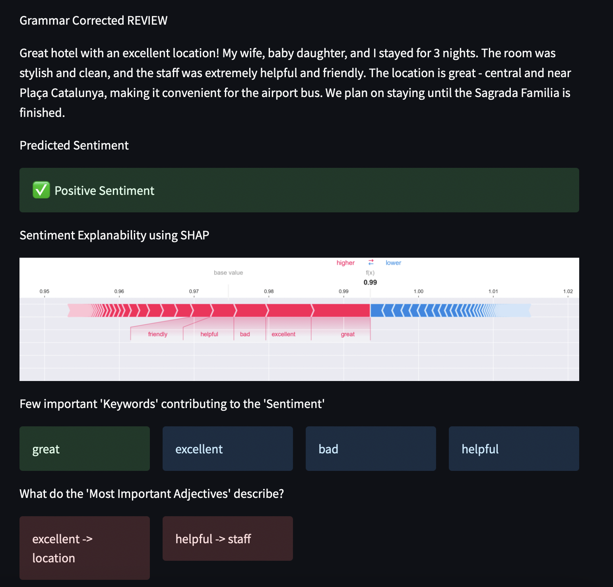

# Explainable Sentiment Analysis using Hotel Reviews
> #### _Archit, Neha, Zenan | Spring '23 | Duke AIPI 540 NLP Project_
&nbsp;

## Project Description

When travelling to a new place one of the most hectic tasks is to search for a good place to stay.
People searching for hotels online have to spend time browsing through different websites and ratings to determine which hotel is good at various things like amenities, location, cleanliness, etc. This process can be time-consuming and overwhelming, especially when there are many hotels to choose from.

Our project aims to simplify this process by analyzing and providing insights based on reviews of the hotels by previous customers. We train a model on a dataset of user reviews and corresponding ratings, which allows us to predict the sentiment of reviews that we haven't seen before. Then, we use explanability techniques like SHAP analysis and dependency parsing to identify the attributes that make these sentiments positive or negative. This information is then presented to the user in a condensed form, providing a measure of the quality of stay at a hotel.

We aim to providing users with more insightful information in a condensed form, our project can help them make quick and well-informed decisions about where to stay, without having to read through all the reviews. This can save them time and reduce the stress of the decision-making process, ultimately leading to a more enjoyable travel experience.

&nbsp;
## Data Sourcing & Processing
For this project we use the [TripAdvisor Dataset](https://www.kaggle.com/datasets/andrewmvd/trip-advisor-hotel-reviews) for Hotel Reviews available on Kaggle. The dataset consists of 20k reviews crawled from Tripadvisor, which tell us what makes a great hotel. The dataset is highly skewed in the favour of positive reviews which is why for training we have chosen to use rating 5 as positve and ratings 1 and 2 as negetive reviews. We have also ignored the neutral category of reviews. 

For the deep learning models that we have fine tuned there is little to no pre-processing of data done.
For the non-deep learning model, we have created vectors of the words using TF-IDF technique. The overhead explanability layer consists of SHAP Analysis & Sentence Dependency Parsing. Dependency parsing is more accurate when the provided content is grammatically correct. To ensure this we have used the OpenAI's GPT-3.5 api and prompted it to correct the grammar for the given review before parsing it to extract adjectives and the direct nouns or indirect pronouns they describe.


&nbsp;
## Explainability Module
Initially, we explored various approaches to add explanability to our project, including using different topic modeling techniques. We began with LDA, but unfortunately, the resulting topics were too generic and didn't provide meaningful insights. Undeterred, we continued our efforts and tried unsupervised transformer approaches to extract topics from reviews. One approach we tried involved extracting noun candidates from the entire reviews corpus and using them to extract topics from new, unseen sentences. While this approach resulted in better outcomes than LDA, the topics were still somewhat generic and lacked the specificity we needed to understand why a hotel was good or bad. We decided to create our own custom explanability layer using SHAP analysis and sentence dependency parsing. The results we obtained from this approach exceeded our expectations and provided us with a comprehensive understanding of why a hotel was good or bad, as demonstrated below. You can find all the code for all the different approaches we tried in the  directory `Topic_Modeling`
&nbsp;
>

&nbsp;
## Model Training and Evaluation
We trained three models for comparison - BERT uncased transformer, LSTM and Random Forest and below were the results:

| Model          |  Accuracy (Test) |
| -------------- | :--------------: |
| BERT           |        87%       |
| Random Forest  |        87%       |
| LSTM           |        85%       |


&nbsp;
### Model 1: BERT uncased Transformer
We performed transfer learning using a pre-trained BERT model and fine tuned it using our data. With a basic GPU, the training took approximately 2 hours for 10 epochs. Again with a basic GPU where the allocated is small, it may run out of memory for inference. So inference on CPU takes around 15-30 seconds where we also consider the time to load the pre-trained model weights. The accuracy of the BERT model was nothing special with 87%. The precision for the negative class, which has low volume of data, is not great.

&nbsp;


&nbsp;
### Following are the steps to run the code and train a BERT Transformer:

**1. Create a conda environment:** 
```
conda create --name environ python=3.9.16
conda activate environ
```
**2. Install python requirements:** 
```
pip install -r requirements.txt 
```
**3. Update the model parameters** 
- You can tweak the model parameters in the configuration file stored at `Sentiment_Transformer/config.py`
**4. To train the model using python scripts** 
- You can train a model direcltly by runnning the driver python script for BERT Transformer: `Sentiment_Transformer/training_transformers.py`
```
python ./Sentiment_Transformer/training_transformers.py
```
**5. To run inference on the trained model using python scripts** 
- You can test the model using the inference script: `Sentiment_Transformer/inference_transformers.py`
```
python ./Sentiment_Transformer/inference_transformers.py
```


&nbsp;
### Model 2: LSTM
Here the torch nn module is used to create embeddings and train the model on the given data. This model doesnt perform all that impressively coming in at 85% accuracy but a slightly better precision for the negative classes

&nbsp;


&nbsp;
### Following are the steps to run the code and train a LSTM:

**1. Create a conda environment:** 
```
conda create --name environ python=3.9.16
conda activate environ
```
**2. Install python requirements:** 
```
pip install -r requirements.txt 
```
**3. Update the model parameters** 
- You can tweak the model parameters in the configuration file stored at `Sentiment_LSTM/config.py`
**4. To train and evaluate the model using python scripts** 
- You can train a model direcltly by runnning the driver python script for LSTM: `Sentiment_LSTM/training_lstm.py`
```
python ./Sentiment_LSTM/training_lstm.py
```

&nbsp;
### Model 3: Random Forest (++Explanability layer)
We first clean the data and remove any unwanted characters like extra white spaces, special characters, new lines, etc. Then we used Bag of Words & TF-IDF techniques to vectorize the given reviews and generte numerical features. These were then fed to a random forest algorithm for training with class weights as the datset is imbalanced. This was by far the quickest model to train and for inference. It matched BERT's accuracy at 87% and showed good metrics for both precision for both classes. So instead of the fine tuning the transformer model further we decided to go forward with the Random Forest model. Another advantage of the Random Forest model is that we can use SHAP analysis on it and explain the predicted outcome of the model. So we effectively traded off an even higher accuracy for explainability.

&nbsp;


&nbsp;
### Following are the steps to run the code and train a Random Forest with TFiDF features:

**1. Create a conda environment:** 
```
conda create --name environ python=3.9.16
conda activate environ
```
**2. Install python requirements:** 
```
pip install -r requirements.txt 
```
**3. Run scripts to clean the raw data** 
- You can clean the text of unwanted charaters and tokenize and lemmatize the data using the following script: `clean_data.py`
```
python clean_data.py
```
**3. Update the model parameters** 
- You can tweak the model parameters in the configuration file stored at `Sentiment_Tfidf/config.py`
**4. To train the model using python scripts** 
- You can train a model direcltly by runnning the driver python script for Random forest model: `Sentiment_Tfidf/random_forest_train.py`
```
python ./Sentiment_Tfidf/random_forest_train.py
```
**5. To run inference on the trained model using python scripts** 
- You can test the model using the inference script: `Sentiment_Tfidf/random_forest_infer.py`. This script along with giving results of a sentiment being postivie or negative, gives addition explanabilty results using, SHAP, dependency paring and grammar correction models present in the same directory.
```
python ./Sentiment_Tfidf/random_forest_infer.py
```


&nbsp;
&nbsp;
&nbsp;
# Running the demo (StreamLit App)

**1. Clone this repository and switch to the streamlit-demo branch**
```
git clone https://github.com/architkaila/Realtime-Hotel-Review-Analysis.git
git checkout streamlit-demo
```
**2. Create a conda environment:** 
```
conda create --name environ python=3.9.16
conda activate environ
```
**3. Install requirements:** 
```
pip install -r requirements.txt
```
**4. Run the application**
```
streamlit run streamlit_app.py
```
**5. StreamLit Appication:**
* You can find the code for streamlit application on the [`streamlit-demo`](https://github.com/architkaila/Realtime-Hotel-Review-Analysis/tree/streamlit_demo) branch
* [Click Here](https://github.com/architkaila/Realtime-Hotel-Review-Analysis/blob/streamlit_demo/README.md) for the streamlit documentation 
* Here you can play around with the streamlit demo 

&nbsp;
## Future Enhancements:

1. To make results more robust, we would have to collect more data for the negative class.
2. The inference scripts( including the SHAP analysis and dependency parsing functionality) and the saved model can be pushed to a serverless cloud component like Azure functions or AWS lambda and an api can be called for faster inference time. With serverless deployment, we would make sure that the resources are being used efficiently.
3. We plan to integrate the model with the google review api, so that we can have user feed the hotel name in real time. Then we can use a weighted metric (like number of likes or upvotes on a review) to extract the top "n" review and run the above model on those "n" reviews to find the general sentiment and highest rated attributes for the given hotel.

&nbsp;
# References

1. "BERT, RoBERTa, DistilBERT, XLNet — which one to use?" by Suleiman Khan (2019) : compares BERT, RoBERTa, and XLNet to LSTM and GRU on sequence modeling tasks. Used to select the models we would want to fine tune and compare for this project.

2. "How to Fine-Tune BERT for Text Classification?" by Chi Sun et al. (2019) : used as a guideline for fine-tuning a pre-trained BERT model. Also used this paper to determine the value in trying to fine-tune ROBERTA and XLNET as compared to BERT.

3. "A Comparative Study on Transformer vs RNN in Speech Applications" by Shigeki Karita et al. (2019)

4. Topic Modelling using LDA for Hotel Reviews: https://www.kaggle.com/code/imnoob/topic-modelling-lda-on-trip-advisor-dataset 


